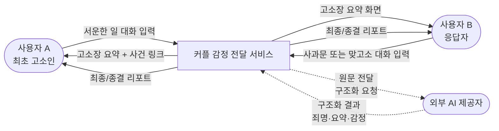
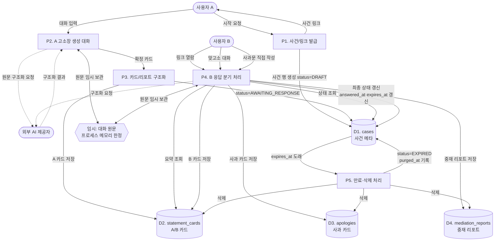
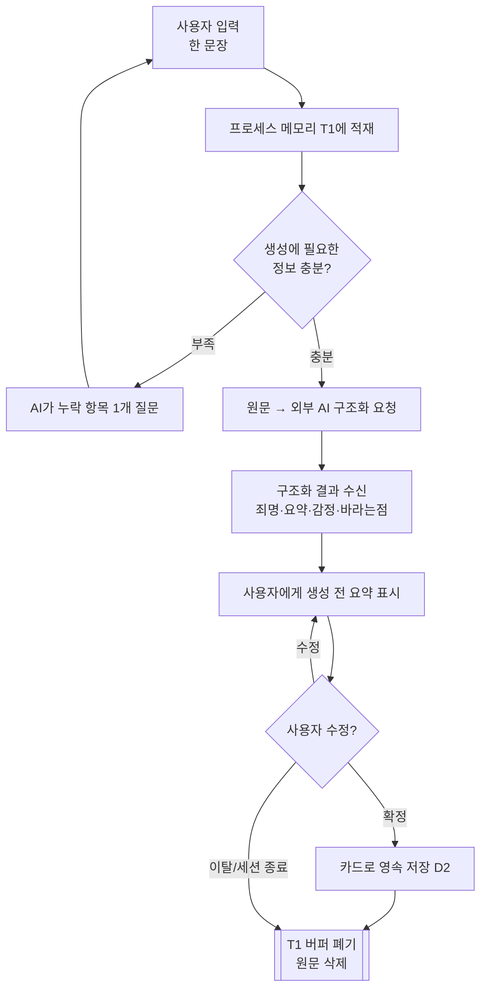
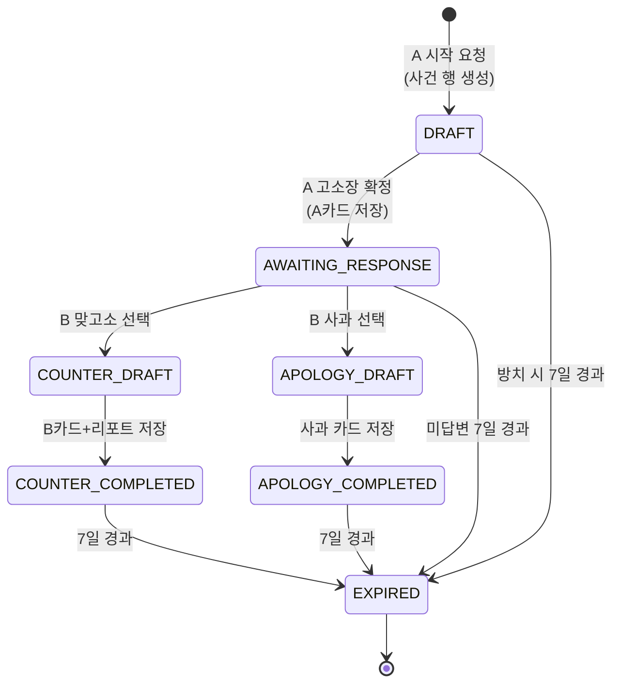
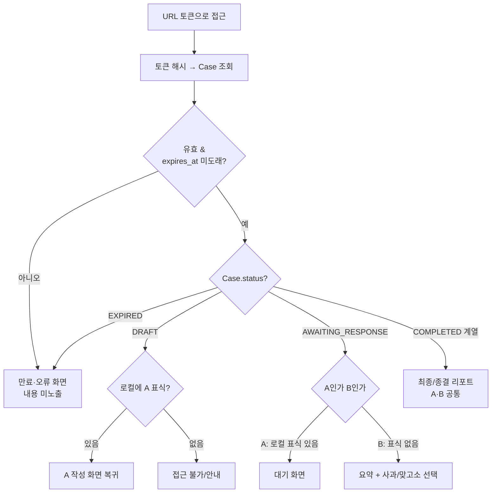
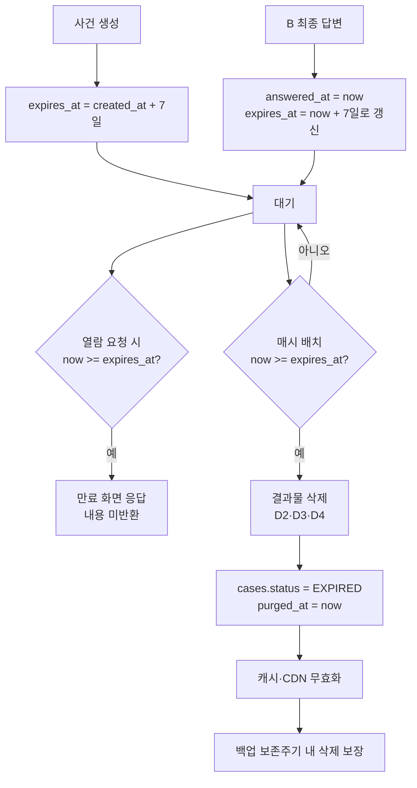

# 데이터 플로우 명세 (Data Flow Specification)

> 상위 문서: `docs/PRD.md` (커플 감정 전달 서비스 기획안)
>
> 문서 버전: 0.5 · 최종 수정: 2026-09-19 · 상태: Accepted
>
> 중점 영역: ① AI 대화 원문 비저장 흐름 · ② 단일 링크 상태 전이별 데이터 흐름 · ③ 7일 만료·삭제 흐름
>
> 기준: PRD §7 단일 링크 설계, §11 데이터 구조, §12 데이터 수명, §13 AI 안전 원칙
>
> 구현 명세: `docs/Supabase_Schema_Design.md`

---

## 1. 문서 목적과 범위

이 문서는 기획안에서 정의한 사건 흐름 위에서 **데이터가 어디서 생겨서, 어디로 흐르고,
어디에 저장되며, 언제 사라지는지**를 정리한다. 기획안이 "무엇을 만드는가(기능)"를
다룬다면, 이 문서는 "그 과정에서 데이터가 어떻게 움직이는가"를 다룬다.

특히 이 서비스의 핵심 제약인 세 가지 — AI 대화 원문을 결과물 생성 후 저장하지 않는다는
것, 하나의 사건을 하나의 링크로 상태만 바꿔가며 관리한다는 것, 결과물이 7일 후
만료·삭제된다는 것 — 을 데이터 관점에서 검증 가능한 수준으로 풀어쓴다.

범위에 포함되는 것은 사건 생성부터 만료까지의 데이터 이동, 저장 대상과 비저장 대상의
경계, 상태 전이 시 읽고 쓰는 데이터다. 범위에서 제외되는 것은 UI 상세 레이아웃,
AI 프롬프트 구체안, 인프라 배포 구조다.

**구체적인 테이블 정의(DDL)·인덱스·RLS 정책은 이 문서가 아니라 §11이 가리키는 스키마
설계 스펙에 있다.** 이 문서는 흐름을, 스펙은 구현을 담당한다.

---

## 2. 데이터 플로우 원칙

기획안의 제품 원칙 중 데이터에 직접 영향을 주는 것을 데이터 규칙으로 다시 정의한다.

1. **저장 대상은 결과물뿐이다.** 앱 DB에 영속 저장하는 것은 확정된 카드·리포트·사과문
   같은 "생성 결과물"과 사건 메타데이터뿐이다. 그 외의 모든 입력·중간물은 원칙적으로
   임시 데이터다.
2. **원문은 흐르되 고이지 않는다.** AI 대화 원문은 생성을 위해 시스템을 통과하지만,
   통과 후에는 어떤 영속 저장소(DB·로그·분석·백업)에도 남지 않는다.
3. **하나의 사건, 하나의 키.** 모든 데이터는 사건 `id`(또는 링크 토큰의 해시)에
   종속된다. 사건이 소멸하면 그에 딸린 모든 데이터가 함께 소멸해야 한다.
4. **링크가 곧 권한이다.** 로그인이 없으므로 데이터 접근 판단의 입력은 오직 URL
   토큰이다. 토큰 원문은 저장하지 않고 해시만 저장한다.
5. **만료는 열람 차단이 아니라 데이터 소멸이다.** 만료는 화면을 가리는 것이 아니라
   결과물 데이터를 실제로 접근 불가/삭제 상태로 만드는 것을 목표로 한다.

---

## 3. 데이터 분류

모든 데이터를 세 등급으로 나눈다. 이 분류가 이후 모든 흐름의 기준이 된다.

| 등급 | 정의 | 예시 | 저장 위치 | 수명 |
| --- | --- | --- | --- | --- |
| **영속 데이터 (Persisted)** | 결과물 생성 후에도 앱이 보관하는 데이터 | 사건 메타데이터, 고소/맞고소 카드, 사과 카드, 중재 리포트 | Supabase Cloud (Postgres) | 최종 답변 시점 기준 7일 (§7.3) |
| **임시 데이터 (Transient)** | 생성 과정에서만 존재하고 결과물 확정 후 폐기되는 데이터 | AI 대화 원문, 생성 전 임시 답변, 미확정 요약 | FastAPI 프로세스 메모리 | 생성 완료 또는 세션 종료 시점 |
| **비저장 데이터 (Never-persisted)** | 어떤 상황에서도 영속 저장소에 남기면 안 되는 데이터 | 원문이 포함된 로그·분석 이벤트, URL 토큰 원문 | 없음 | 즉시 폐기 |

핵심은 **AI 대화 원문**이다. 원문은 생성 중에는 임시 데이터로 존재하지만, 로그·분석·
백업의 관점에서는 비저장 데이터로 취급해야 한다. 즉 "잠깐 처리는 하되, 결과물 밖으로는
절대 새어나가지 않는다"가 원문의 위치다.

### 영속 데이터 상세

기획안 §11의 구조를 저장 관점으로 다시 본다.

| 엔티티 | 테이블 | 저장 여부 | 비고 |
| --- | --- | --- | --- |
| `Case` (사건 메타) | `cases` | 저장 | `id`, `public_token_hash`, `writer_token_hash`, `status`, `response_type`, `created_at`, `answered_at`, `expires_at`, `purged_at` |
| `StatementCard` (A/B 카드) | `statement_cards` | 저장 | AI가 원문에서 추출·구조화한 **결과물**. 원문은 포함하지 않음 |
| `Apology` (사과 카드) | `apologies` | 저장 | B가 직접 입력한 텍스트. AI 생성물 아님 |
| `MediationReport` (중재 요약) | `mediation_reports` | 저장 | AI가 A·B 카드로부터 생성한 결과물 |
| AI 대화 원문 | **없음** | **비저장** | 카드 생성에만 사용하고 폐기. 담을 컬럼이 스키마에 존재하지 않음 |
| 생성 전 임시 답변 | **없음** | **비저장** | 확정 전까지만 세션에 유지 |
| 원문 포함 로그/분석 | **없음** | **비저장** | 애초에 기록하지 않음 |

`Case`의 `answered_at`·`purged_at`은 PRD §11 초안에 없던 필드다. 각각 만료 기준 시각
계산(§7.3)과 삭제 완료 증명(§9)을 위해 추가했다.

**토큰이 둘이다.** `public_token`(링크)과 `writer_token`(A의 쓰기 권한). 둘 다 SHA-256
해시만 저장하고 원문은 사건 생성 응답에서만 나간다. B에게는 쓰기 토큰을 주지 않는다 —
"링크를 가진 사람이 B"가 전제이며, B의 중복 제출은 토큰이 아니라 상태 조건부 UPDATE와
DB 제약이 막는다 (§7.2).

`statement_cards`에 `hurt_point`·`expected_behavior`·`assumption`이, `apologies`에
`admitted_point`가 2026-09-15에 추가됐다. 프론트의 공유 항목 선택 기능이 이미 다루던
항목인데 담길 곳이 없어 DB가 흡수한 것이다 (`docs/API_Design.md` §8-1).

그 뒤 `statement_cards`에 두 컬럼이 더 붙었다. 둘 다 카드와 함께 한 트랜잭션에서 저장되며
대화 원문은 담지 않는다.

| 컬럼 | 추가 | 내용 |
| --- | --- | --- |
| `story_intro` | 2026-09-18 | 수신자에게 먼저 보여주는 1인칭 도입문 (`Story_Intro_Design.md`) |
| `emotion_scores` | 2026-09-19 | 감정 점수·대표 이미지·6축 왜곡값 스냅샷 (`Emotion_Image_Warp_PRD.md`) |

---

## 4. Level 0 — 컨텍스트 다이어그램

시스템을 하나의 상자로 보고, 외부 주체와 오가는 데이터만 표시한다.



외부 AI 제공자와의 경계(점선)가 데이터 보호의 취약점이다. 원문이 시스템 밖으로 나가는
유일한 지점이므로, 이 경로의 보관·학습·모니터링 정책은 §7.1에서 별도로 다룬다.

---

## 5. Level 1 — 데이터 흐름 다이어그램 (DFD)

시스템 내부를 프로세스(P)와 데이터 스토어(D)로 나눠 본다.



이 다이어그램에서 확인할 세 가지는 다음과 같다. 원문(T1)은 P2·P4에서만 임시로 존재하고
어떤 데이터 스토어(D1~D4)로도 화살표가 가지 않는다. 모든 스토어는 D1의 상태에 종속된다.
P5(만료 처리)만이 D2·D3·D4를 삭제하는 유일한 경로다.

---

## 6. 데이터 스토어 정의

| ID | 스토어 | 키 | 생성 시점 | 소멸 시점 |
| --- | --- | --- | --- | --- |
| D1 | `cases` | `id` (PK) / `public_token_hash` (UNIQUE) | **A의 시작 요청 시(P1), `status=DRAFT`로 생성** | 만료 시 결과물만 삭제하고 행은 `EXPIRED`로 유지 (§7.3) |
| D2 | `statement_cards` | `id` (PK), `UNIQUE(case_id, side)` | 각 측 카드 확정 시 | 사건 만료 시 물리 삭제 |
| D3 | `apologies` | `case_id` (PK) | B 사과문 제출 시 | 사건 만료 시 물리 삭제 |
| D4 | `mediation_reports` | `case_id` (PK) | 맞고소 완료 시 | 사건 만료 시 물리 삭제 |
| T1 | 대화 원문(임시) | 세션 식별자 | 대화 시작 시 | 카드 확정 또는 세션 종료 시 (영속화 없음) |

D2~D4는 모두 `case_id` 외래키로 D1에 묶이며 `ON DELETE CASCADE`가 걸린다. 사건 행을
삭제하면 딸린 데이터가 함께 지워진다(§2-3).

> **v0.1에서 수정된 항목.** v0.1은 D1의 생성 시점을 "A가 고소장 확정 시"로 적었으나,
> 같은 문서 §5는 P1이 발급과 동시에 `DRAFT`로 생성한다고 표시해 서로 모순이었다.
> **§5가 옳다** — 링크를 발급하려면 토큰 해시로 조회할 행이 이미 존재해야 한다.
> §7.2 표의 "`DRAFT` — 쓰는 데이터: 없음"도 "**결과물**을 저장하지 않는다"로 읽는다.

### D3·D4의 키 설계

`apologies`와 `mediation_reports`는 `case_id` 자체를 기본키로 둔다. 별도 제약 없이
"사건당 1건"이 DB 차원에서 강제되므로, §7.2에서 확정한 *1회 제출 + 즉시 잠금* 규칙이
애플리케이션 코드와 무관하게 보장된다. D2는 A·B 두 장이 필요하므로
`UNIQUE(case_id, side)`로 같은 효과를 낸다.

---

## 7. 중점 영역

### 7.1 ① AI 대화 원문 비저장 흐름

원문의 생명주기를 단계별로 추적한다. 목표는 "생성에는 쓰되, 생성이 끝나면 어디에도
남지 않는다"를 흐름으로 증명하는 것이다.



원문 데이터 처리 규칙을 단계별로 정리하면 다음과 같다.

| 단계 | 원문 상태 | 저장소 | 규칙 |
| --- | --- | --- | --- |
| 입력 중 | 활성 | 프로세스 메모리(T1) | 영속 DB에 쓰지 않음 |
| 구조화 요청 | 전송 중 | 외부 AI로 전달 | 전송 로그에 원문 본문 미기록 |
| 결과 수신 | 파생물만 유지 | 메모리 | 구조화 결과만 다음 단계로 |
| 카드 확정 | 폐기 대상 | — | 결과물(카드)만 D2에 저장, 원문은 삭제 |
| 세션 이탈 | 폐기 | — | 확정 전 이탈 시 원문·임시답변 모두 소멸 |

**저장 경계 (반드시 지킬 것)**

- 애플리케이션 로그에 원문 본문을 남기지 않는다. 에러 로그도 예외가 아니다
  (PRD §14 "AI 생성 실패 시 서버 로그에 원문을 남기지 않음").
- 분석 이벤트에 원문을 실어 보내지 않는다. 이벤트는 "카드 생성됨" 같은 사실만 기록하고
  내용은 담지 않는다.
- 백업·스냅샷 대상 테이블에 원문 컬럼을 두지 않는다.

마지막 항목은 **스키마 설계로 이미 구조적으로 충족된다.** 원문을 담을 컬럼과 테이블이
애초에 존재하지 않으므로 "실수로 저장"이 불가능하다. 반면 앞의 두 항목은 스키마가
보장할 수 없고 FastAPI 구현 시 별도로 확인해야 한다(§9).

**작성 중 임시 저장 충돌 — 결정됨**

"B가 답변 작성 중 페이지를 종료했을 때 복구를 제공하려면 원문을 어딘가 저장해야 하는데
이는 비저장 원칙과 충돌한다"는 문제에 대해, **서버에는 저장하지 않는다**로 확정한다.
복구가 필요하면 브라우저 로컬 저장소에만 임시 보관하고 서버로 올리지 않는다.
서버에 짧은 TTL로 암호화 임시 보관하는 안은 채택하지 않는다.

로컬 저장소 복구를 실제로 구현할지 여부는 프론트엔드 판단에 맡기며, 어느 쪽이든 이
문서의 원칙에는 영향이 없다.

**외부 AI 제공자 경계 — 해소됨 (2026-09-14)**

원문이 시스템 밖으로 나가는 유일한 지점이므로, 제공자의 보관 정책이 확정되기 전에는 이
경로가 "비저장" 원칙을 만족한다고 볼 수 없었다.

**제공자는 OpenAI(`gpt-4.1-mini`)로 정해졌고, 호출에 `store=False`를 적용해 무보관
(zero-retention)을 확보했다** (`backend/app/services/openai_gateway.py`). 타임아웃 25초,
재시도 0회다 — 재시도를 끄면 실패가 빨리 드러나고 원문이 불필요하게 재전송되지 않는다.

남은 것은 안전 모니터링 목적의 제공자 측 보관 여부 확인이다. `store=False`는 API 보관을
끄지만 제공자의 남용 탐지 파이프라인까지 보장하지는 않는다.

---

### 7.2 ② 단일 링크 상태 전이별 데이터 흐름

하나의 링크(= 하나의 `Case`)가 상태를 바꿔갈 때, 각 상태에서 어떤 데이터를 읽고 쓰는지를
정리한다. URL은 절대 바뀌지 않고, `cases.status`만 전이한다.



각 상태에서의 데이터 입출력은 다음과 같다.

| 상태 | 읽는 데이터 (Read) | 쓰는 데이터 (Write) | 표시 화면 |
| --- | --- | --- | --- |
| `DRAFT` | D1 상태, T1(임시 원문) | 없음 (결과물 기준) | A 작성 화면 |
| `AWAITING_RESPONSE` | D1 상태, D2(A카드) | D1.status, D2(A카드) | A=대기 / B=요약+선택 |
| `COUNTER_DRAFT` | D1, D2(A카드), T1 | D1.status, D1.response_type | B의 AI 대화 화면 |
| `COUNTER_COMPLETED` | D1, D2(A·B카드), D4 | D2(B카드), D4(리포트), D1.status·answered_at·expires_at | A/B 카드 + 중재 요약 |
| `APOLOGY_DRAFT` | D1, D2(A카드) | D1.status, D1.response_type | 사과문 작성 화면 |
| `APOLOGY_COMPLETED` | D1, D2(A카드), D3 | D3(사과 카드), D1.status·answered_at·expires_at | 사과 카드 + 종결 리포트 |
| `EXPIRED` | D1.status만 | D2·D3·D4 삭제, D1.status·purged_at | 만료 안내 화면 |

**동일 링크에서의 역할·접근 판단 흐름**

로그인이 없으므로 같은 URL로 들어온 요청이 A인지 B인지, 어떤 화면을 보여줄지는 사건
상태와 브라우저 로컬 상태로만 판단한다.



`V` 분기의 `expires_at` 검사가 §7.3에서 말하는 **접근 시점 검사(lazy)** 다. 배치 삭제가
돌기 전이라도 이 지점에서 내용 반환이 차단된다.

**데이터 무결성 규칙 — 결정됨**

링크가 곧 권한이라는 구조상 필요한 규칙을 다음과 같이 확정한다.

| 항목 | 결정 | 구현 방식 |
| --- | --- | --- |
| B의 답변 허용 횟수 | **1회만** | D3·D4의 PK(`case_id`), D2의 `UNIQUE(case_id, side)` |
| 제출 후 수정 | **불가. 제출 즉시 읽기 전용** | 위와 동일 |
| 동시 다중 제출 | **최초 성공 요청만 반영**, 이후는 읽기 전용 리포트로 유도 | 상태 조건부 UPDATE (아래) |
| 링크 오발송 시 폐기 | **MVP 제외** | PRD §15 범위 밖. 추후 `DISCARDED` 상태 추가 |

상태 전이는 애플리케이션이 조건부 UPDATE로 수행한다.

```sql
update cases
   set status = 'COUNTER_COMPLETED',
       answered_at = now(),
       expires_at = now() + interval '7 days'
 where id = $1 and status = 'COUNTER_DRAFT';
```

영향 행이 0이면 이미 전이된 것이므로 중복 제출로 간주하고 읽기 전용 리포트로 보낸다.
결과물 테이블의 PK·UNIQUE 제약이 최후의 방어선이다.

---

### 7.3 ③ 7일 만료·삭제 데이터 플로우

만료는 이 서비스에서 "화면을 가리는 일"이 아니라 "데이터를 소멸시키는 일"이다.
따라서 만료 트리거, 삭제 대상, 삭제 완료 확인의 세 부분으로 나눠 설계한다.



**만료 기준 시각 — 결정됨**

`expires_at`은 **최종 답변 시각 + 7일**로 한다. 두 사람 모두 완성된 리포트를 온전히
7일간 볼 수 있어야 한다는 판단이다.

다만 이 기준만 쓰면 B가 영영 답하지 않은 사건에 만료 시각이 존재하지 않아 영구히 남는다.
따라서 실제 동작은 다음 두 단계다.

1. 사건 생성 시 `expires_at = created_at + 7일`로 초기화한다. 미답변 사건도 7일 뒤 정리된다.
2. B의 최종 답변 시 `expires_at = answered_at + 7일`로 **갱신**한다.

결과적으로 사건의 총 수명 상한은 (B 대기 기간 + 7일)이며, 리포트가 존재하는 기간은
항상 7일이다.

**만료 트리거 — 두 방식 병행**

| 방식 | 역할 | 구현 |
| --- | --- | --- |
| 접근 시점 검사 (lazy) | 열람을 **즉시** 차단 | FastAPI가 조회 시 `expires_at` 확인 후 내용 없이 만료 응답 |
| 배치 삭제 (scheduled) | 물리 삭제를 **보장** | `pg_cron`이 매시 정각 `purge_expired_cases()` 실행 |

배치는 최대 1시간의 지연이 있으므로 그 틈을 lazy 검사가 막는다. 둘 중 하나만으로는
§2-5 원칙을 만족하지 못한다 — lazy만으로는 데이터가 남고, 배치만으로는 최대 1시간 동안
만료된 내용이 노출된다.

배치를 백엔드 스케줄러가 아니라 `pg_cron`으로 둔 이유는 `docs/Tech_ADR.md` §10의
"백엔드에 마이그레이션·운영 인프라를 쌓지 않는다"는 방향과 일치하기 때문이다.
삭제 로직이 마이그레이션 SQL 안에 함께 배포된다.

**삭제 범위**

| 대상 | 만료 시 처리 |
| --- | --- |
| D2 `statement_cards` | 물리 삭제 |
| D3 `apologies` | 물리 삭제 |
| D4 `mediation_reports` | 물리 삭제 |
| D1 `cases` | 행은 **유지**하고 `status=EXPIRED`, `purged_at=now()` 기록 |
| 캐시/CDN | 무효화하여 만료 후 캐시로 내용이 노출되지 않도록 |
| 백업 | 백업 보존주기 내에서 삭제가 보장되어야 함 |

D1 행을 남기는 이유는 두 가지다. 같은 토큰이 재발급되는 것을 막고(§2-4),
`purged_at`으로 삭제가 실제로 완료됐음을 검수에서 증명할 수 있다(§9).
남는 것은 메타데이터뿐이며 사건 내용은 포함되지 않는다.

**미결 사항**

만료 후 캐시·백업까지 삭제를 완료해야 하는 허용 시간(예: 백업 보존주기 N일)을 명시해야
"만료 후 어떤 저장소에서도 내용이 나오지 않는다"를 검수할 수 있다. Supabase Cloud의
백업 보존 주기 확인이 선행되어야 한다.

---

## 8. 시나리오별 End-to-End 데이터 플로우

### 8.1 맞고소 경로

A의 시작 요청으로 `cases` 행이 `DRAFT`로 생성되고 링크가 발급된다. A 대화 원문(T1)에서
A 카드(D2)가 만들어지고 원문은 폐기된다. 사건은 `AWAITING_RESPONSE`로 전이한다.

B가 맞고소를 택하면 B 대화 원문(T1)에서 B 카드(D2)가 만들어지고, A·B 두 카드를 입력으로
중재 리포트(D4)가 생성된다. 두 원문 모두 폐기되고 사건은 `COUNTER_COMPLETED`가 되며,
이 시점에 `answered_at`이 기록되고 `expires_at`이 갱신된다.

이후 `expires_at` 도래 시 D2·D4가 삭제되고 `EXPIRED`로 전이한다.

### 8.2 사과 경로

A 카드(D2) 저장까지는 동일하다. B가 사과를 택하면 AI 대화 없이 B가 직접 사과문을
입력하고, 그 텍스트가 사과 카드(D3)로 저장된다(AI 생성물 아님, 원문 개념 자체가 없음).
사건은 `APOLOGY_COMPLETED`가 되고 `expires_at`이 갱신된다. 도래 시 D2·D3가 삭제된다.

사과 경로에서는 AI가 사과문에 없는 약속·인정 내용을 만들어내면 안 되므로(PRD §13),
D3에 저장되는 것은 B의 입력 텍스트 그대로여야 한다. 파생·창작 데이터가 D3에 섞이지
않는 것이 검수 포인트다.

### 8.3 미답변 만료 경로

A가 링크를 보냈으나 B가 7일간 열지 않거나 답하지 않은 경우다. `AWAITING_RESPONSE`
상태에서 `created_at + 7일`이 도래하면 A 카드(D2)가 삭제되고 `EXPIRED`로 전이한다.
A가 작성 중 이탈해 `DRAFT`로 남은 사건도 같은 경로로 정리된다.

---

## 9. 데이터 무결성·검수 매핑

PRD §17 검수 기준을 데이터 관점 검증 항목으로 매핑한다. "보장 주체" 열은 그 항목이
무엇에 의해 지켜지는지를 나타낸다 — **스키마**는 구조적으로 위반이 불가능하다는 뜻이고,
**구현**은 코드 리뷰·테스트로 확인해야 한다는 뜻이다.

| 검수 항목 | 검증 방법 | 보장 주체 |
| --- | --- | --- |
| 원문이 DB에 저장되지 않는다 | 원문 컬럼·테이블이 스키마에 부재함을 확인 | **스키마** |
| 원문이 로그·분석에 저장되지 않는다 | 로그 출력·이벤트 페이로드에 원문 미포함 확인 | 구현 |
| 생성된 결과물만 보관된다 | 영속 테이블이 `cases` + 결과물 3개뿐임을 확인 | **스키마** |
| 같은 URL이 답변 후에도 안 바뀐다 | `public_token_hash` 불변, `status`만 전이 확인 | **스키마** |
| 만료 후 내용이 노출되지 않는다 | lazy 검사 **구현됨**(조회·쓰기 모두 410). `pg_cron` 배치는 **실행 이력 미확인** | 스키마 + 구현 |
| 만료 후 캐시·백업에서도 안 나온다 | 캐시 무효화, 백업 보존주기 내 삭제 확인 | 구현 (§7.3 미결) |
| 사과문이 그대로 표시된다 | `apologies.body`가 입력 원본과 일치, AI 파생 필드 미주입 | 구현 |
| 중복 제출 방지 | PK·UNIQUE 제약 + 조건부 UPDATE 동작 확인 | **스키마** |
| 외부 AI 제공자가 원문을 보관하지 않는다 | 제공자 정책 확인, 무보관 옵션 적용 | 외부 (§7.1 미결) |

---

## 10. 남은 미결 사항

v0.1의 미결 8건 중 5건이 확정되었다. 남은 항목은 다음과 같다.

| # | 항목 | 성격 | 관련 |
| --- | --- | --- | --- |
| 1 | 만료 후 캐시·백업 삭제 완료 허용 시간 | 운영 정책 | §7.3 |
| 2 | 제공자 측 안전 모니터링 보관 여부 확인 | 외부 의존 | §7.1 |
| 3 | 작성 중 임시 저장을 브라우저 로컬에 구현할지 | 프론트 판단 | §7.1 (서버 무저장은 확정) |

1~2는 서비스 오픈 전, 3은 B 응답 화면 구현 전에 정하면 된다.

**해소됨 (2026-09-14).** "외부 AI 제공자의 요청 보관·학습 정책"과 "무보관 옵션 필수 적용
여부"는 OpenAI `store=False` 적용으로 결정됐다(§7.1).

---

## 11. 구현 매핑

이 문서의 흐름이 실제로 어디에 구현되는지를 정리한다.

| 문서 요소 | 구현 위치 |
| --- | --- |
| D1~D4 테이블 정의, 제약, 인덱스 | `supabase/migrations/` (설계 근거는 `docs/Supabase_Schema_Design.md`) |
| RLS — `service_role` 단독 접근 | 같은 마이그레이션. 브라우저는 Supabase에 직접 붙지 않음 |
| `purge_expired_cases()` + `pg_cron` 스케줄 | 같은 마이그레이션 |
| 토큰 생성·해시·상수시간 비교 | `backend/app/core/tokens.py` |
| DB 연결 (지연 생성 풀) | `backend/app/db.py` |
| 사건 SQL — 여기에만 둔다 | `backend/app/repositories/cases.py` |
| **lazy 만료 검사** | `backend/app/api/cases.py`의 `_expired()` — 조회·쓰기 양쪽에서 |
| 상태 전이 (조건부 UPDATE) | `backend/app/repositories/cases.py` |
| T1 — 원문 임시 보관과 폐기 | `backend/app/` — 대화는 **클라이언트가 구조화 상태를 왕복**시키는 방식이라 서버에 남지 않는다. 단 문서 생성 직전 감정 채점에서 사용자 발화 전체가 한 번 더 전송된다 (`docs/API_Design.md` §3) |
| 카드 죄명·한 줄 요약·도입문 생성 | `backend/app/services/card_summary.py`, `app/api/card_summary.py` |
| 감정 점수 산출·왜곡 이미지 렌더 | `backend/app/services/{emotion_profile,emotion_warp,warp_hexagon}.py`, `app/assets/emotions/` |
| HTTP 계약 (경로·요청·응답·오류) | `docs/API_Design.md` |
| 로컬 역할 표식(A/B 판정) | `frontend/src/` 브라우저 저장소 |

---

## 변경 이력

| 버전 | 날짜 | 변경 |
| --- | --- | --- |
| 0.5 | 2026-09-19 | §3에 `story_intro`·`emotion_scores` 추가. §11 구현 매핑에 카드 요약·감정 채점 모듈 추가. 감정 채점의 원문 전송 예외 명시 |
| 0.4 | 2026-09-16 | §3에 `writer_token_hash`와 09-15 추가 컬럼 4개 반영, 토큰 두 종류 설명 추가. §9에 lazy 검사 구현 완료·`pg_cron` 실행 이력 미확인 표시. §11 구현 매핑을 실제 모듈로 갱신 |
| 0.3 | 2026-09-14 | §7.1 외부 AI 제공자 경계 해소(OpenAI `store=False`). §10 미결 4건 → 3건. §11에 API 설계 문서 및 T1 실제 구현 방식 반영 |
| 0.2 | 2026-09-12 | §6 D1 생성 시점 모순 해소(P1 발급 시 생성). §7.1 서버 무저장 확정. §7.2 제출 1회·즉시 잠금·폐기 기능 MVP 제외 확정. §7.3 만료 기준(최종 답변 +7일, 생성 시 초기화)과 pg_cron 확정. §8.3 미답변 만료 경로 추가. §9 보장 주체 열 추가. §11 구현 매핑 추가. 미결 8건 → 4건 |
| 0.1 | 2026-09-10 | 최초 작성 |
