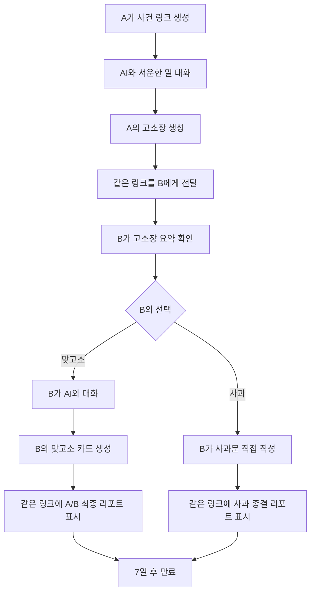

> 서비스명: 미정
> 
> 
> 문서 유형: MVP 제품 기획서(PRD)
> 
> 문서 버전: 0.1
> 
> 상태: 핵심 흐름 확정 / 세부 정책 일부 미정
> 
> 기준: Ouroboros Interview `interview_20260907_141945`
> 

---

## 1. 서비스 한 줄 정의

연인에게 서운했던 일을 AI와 이야기하면 장난스럽고 귀여운 고소장으로 정리해 하나의 링크로 전달하고, 상대가 같은 링크에서 사과하거나 맞고소한 뒤 두 사람의 생각을 함께 볼 수 있게 하는 감정 전달 서비스다.

## 2. 해결하려는 문제

연인 사이의 서운함은 직접 말하려고 하면 비난이나 싸움처럼 들리기 쉽다. 반대로 감정을 참으면 오해가 오래 남는다.

이 서비스는 서운함을 법적 판단이나 잘잘못의 판결로 다루지 않는다. 사용자가 자신의 경험과 감정을 정리하고, 상대방이 부담을 낮춘 상태에서 내용을 읽고 답할 수 있도록 돕는다. ‘고소장’은 관계 회복을 위한 장난스러운 표현 장치다.

## 3. 제품 목표

### 핵심 목표

- 말하기 어려운 서운함을 공격적이지 않은 형태로 정리한다.
- 상대방이 내용을 짧게 이해한 뒤 사과 또는 맞고소로 답할 수 있게 한다.
- 두 사람의 관점을 나란히 보여주고, 공통점과 차이를 중립적으로 정리한다.
- 최초 작성부터 최종 결과까지 사건 하나를 하나의 링크로 관리한다.

### MVP 성공 기준

초기 MVP에서는 만족도·전환율 같은 정량 지표를 합격 기준으로 사용하지 않는다. 아래 핵심 기능이 정상적으로 끝까지 작동하면 성공으로 본다.

1. A가 AI 대화를 통해 고소장을 생성할 수 있다.
2. 생성된 고소장을 하나의 링크로 B에게 전달할 수 있다.
3. B가 같은 링크에서 고소장 요약을 읽고 `사과하기` 또는 `맞고소하기`를 선택할 수 있다.
4. 맞고소를 선택하면 B도 AI 대화를 거쳐 자신의 카드를 생성할 수 있다.
5. 사과를 선택하면 B가 사과문을 직접 작성할 수 있다.
6. B의 답변 후 같은 링크가 최종 결과 페이지로 갱신된다.
7. 생성된 결과물은 7일 후 만료되어 열람할 수 없다.
8. AI 대화 원문은 결과물 생성 완료 후 저장되지 않는다.

## 4. 핵심 용어

| 용어 | 정의 |
| --- | --- |
| A | 최초로 서운함을 이야기하고 고소장을 만든 사용자 |
| B | 링크를 전달받아 사과 또는 맞고소로 답하는 사용자 |
| 사건 | A의 고소부터 B의 답변과 최종 결과까지 묶는 단위 |
| 사건 링크 | 사건의 모든 단계가 표시되는 하나의 고유 URL |
| 고소 카드 | A의 사건 해석·감정·바라는 점을 요약한 카드 |
| 맞고소 카드 | B의 사건 해석·감정·바라는 점을 요약한 카드 |
| 사과 카드 | B가 직접 작성한 사과문을 표시하는 카드 |
| 최종 리포트 | A와 B의 답변 및 AI의 중립적 정리를 보여주는 결과 화면 |

## 5. 제품 원칙

1. **하나의 사건, 하나의 링크**
    
    단계별로 새 URL을 만들지 않는다. 사건 상태에 따라 동일한 URL의 화면만 갱신한다.
    
2. **판결보다 이해**
    
    AI는 누가 옳은지 판정하지 않고, 각자의 감정과 해석 차이를 정리한다.
    
3. **귀엽지만 가볍게 여기지 않기**
    
    표현은 장난스럽게 만들되 사용자의 감정을 희화화하거나 축소하지 않는다.
    
4. **최소한의 입력**
    
    고소장 생성에 필요한 핵심 정보만 묻는다. 선택 정보 때문에 작성이 막히지 않아야 한다.
    
5. **원문 최소 보관**
    
    AI 대화 원문은 생성에 필요한 동안만 처리하고 결과물 생성 후 앱에 저장하지 않는다.
    

## 6. 전체 사용자 흐름

### 사건 상태

| 상태 | 의미 | 동일 링크에서 보이는 화면 |
| --- | --- | --- |
| `DRAFT` | A가 AI와 대화 중 | A의 작성 화면 |
| `AWAITING_RESPONSE` | 고소장 생성 완료, B의 답변 대기 | A에게는 대기 상태, B에게는 고소장과 답변 선택 |
| `COUNTER_DRAFT` | B가 맞고소 작성 중 | B의 AI 대화 화면 |
| `COUNTER_COMPLETED` | 맞고소 완료 | A/B 카드와 종합 리포트 |
| `APOLOGY_DRAFT` | B가 사과문 작성 중 | 사과문 작성 화면 |
| `APOLOGY_COMPLETED` | 사과문 제출 완료 | 사과 카드와 종결 리포트 |
| `EXPIRED` | 보관 기간 종료 | 만료 안내 화면 |

## 7. 단일 링크 설계

### 핵심 규칙

- 사건 생성 시 예측하기 어려운 고유 토큰을 가진 URL 하나를 발급한다.
- A가 B에게 전달하는 URL과 B의 답변 후 생성되는 결과 URL은 동일하다.
- B가 답변을 제출하면 같은 사건의 상태와 화면 내용이 갱신된다.
- 최종 상태가 되면 A와 B 모두 같은 링크에서 같은 리포트를 본다.
- 로그인과 비밀번호는 사용하지 않는다.
- 검색엔진에 노출되지 않도록 색인 차단을 적용한다.

### 로그인 없는 단일 링크의 한계

링크를 가진 사람이 누구인지 완전히 증명할 수 없다. 따라서 MVP에서는 링크 자체가 열람 권한 역할을 한다. 최초 작성자의 브라우저에는 A 역할을 로컬 상태로 표시할 수 있지만, 시크릿 창이나 다른 기기에서는 역할을 보장할 수 없다.

다음 사항은 구현 전에 세부 규칙을 확정해야 한다.

- B의 답변을 한 번만 허용할지 여부
- 답변 완료 후 수정 가능 여부
- 여러 사람이 동시에 답변할 때의 처리
- 링크를 잘못 보낸 경우 폐기 기능 제공 여부

## 8. AI 대화 및 최소 입력 데이터

### 필수 데이터

| 항목 | 수집 방법 | 목적 |
| --- | --- | --- |
| 사건 내용 | 자유 대화 | 무슨 일이 있었는지 파악 |
| 감정과 이유 | AI 추출 후 필요 시 확인 | 사용자의 핵심 감정이 왜곡되지 않도록 표현 |
| 상대에게 바라는 점 | 선택 또는 자유 입력 | 고소장의 결론과 대화 목적 구성 |

### 선택 데이터

- 서로를 부르는 호칭
- 정확한 날짜와 장소
- 실제로 주고받은 말
- 귀여운 벌칙 제안
- 장난 수위

선택값을 입력하지 않으면 중립 호칭과 기본적인 귀여운 톤을 사용한다.

### AI가 내부적으로 확인할 내용

육하원칙 전체를 사용자가 양식으로 작성하게 만들지 않는다. AI는 자유 대화에서 아래 항목을 파악하고, 고소장 생성에 꼭 필요한 내용이 빠졌을 때만 추가 질문한다.

- 누가, 언제, 어디서, 무엇을, 어떻게, 왜
- 사용자가 직접 경험한 사실과 사용자의 추측
- 사용자가 기대했던 행동과 실제 행동의 차이
- 가장 크게 느낀 감정과 그 이유
- 상대방에게 듣거나 바라는 내용

### 대화 원칙

- 질문은 한 번에 하나씩 제시한다.
- 같은 정보를 반복해서 묻지 않는다.
- 모르는 내용을 억지로 채우지 않는다.
- 사용자가 말하지 않은 상대방의 의도나 감정을 사실처럼 단정하지 않는다.
- 충분한 정보가 모이면 생성 전 요약을 보여주고 사용자가 수정할 수 있게 한다.

## 9. 화면별 기획

### 9.1 시작 화면

#### 목적

서비스의 성격을 짧게 설명하고 A가 고소장 작성을 시작하게 한다.

#### 포함 요소

- 한 문장 소개
- `귀엽게 고소장 만들기` 버튼
- 실제 법률 서비스가 아니라는 안내
- 링크를 받은 사용자를 위한 별도 입력창은 제공하지 않음

### 9.2 A의 AI 대화 화면

#### 목적

A가 서운했던 일을 편하게 말하고 고소장 생성에 필요한 최소 정보를 정리한다.

#### 포함 요소

- AI 메시지와 사용자 답변
- 현재 파악한 내용의 간단한 표시
- 이전 답변 수정
- 대화 종료 및 고소장 미리보기
- 나가기 전 임시 대화가 사라질 수 있다는 안내

### 9.3 고소장 미리보기 및 생성 화면

#### 목적

A가 AI의 해석이 자신의 의도와 맞는지 확인한 후 사건 링크를 생성한다.

#### 고소장 포함 내용

1. 귀여운 죄명
예: `연락두절죄`, `애인걱정유발죄`
2. 사건 한 줄 요약
3. 사건 내용
4. A가 느낀 감정과 이유
5. 서로 다르게 생각할 수 있는 지점
6. A가 상대방에게 바라는 점
7. 판단 유보 안내
AI가 사실로 확인하지 못한 내용은 추측 또는 A의 관점으로 표시한다.

#### 주요 행동

- 내용 수정
- 고소장 확정
- 링크 복사 및 공유

### 9.4 B의 고소장 열람 및 선택 화면

#### 목적

B가 긴 내용을 모두 읽지 않아도 사건의 핵심을 이해하고 답변 방식을 선택한다.

#### 상단 요약

- 귀여운 죄명
- 사건 한 줄 요약
- A가 가장 서운했던 지점
- A가 느낀 핵심 감정
- A가 B에게 바라는 점

#### 상세 내용

- `고소장 전체 보기`로 원문 카드 펼치기
- 서비스가 판결을 내리지 않는다는 짧은 안내

#### 주요 행동

- `사과하기`
- `맞고소하기`

### 9.5 B의 맞고소 AI 대화 화면

#### 목적

B가 같은 사건을 자신의 관점에서 설명하고 맞고소 카드를 만든다.

#### 수집 항목

A와 동일하게 사건 내용, 감정과 이유, 상대에게 바라는 점만 필수로 한다. AI는 A의 주장을 B에게 사실로 강요하지 않고, B가 동의하는 부분과 다르게 보는 부분을 구분한다.

### 9.6 맞고소 최종 리포트 화면

#### 상단 카드 영역

화면을 좌우 두 개의 카드로 나눈다. 모바일에서는 A 카드와 B 카드를 세로로 배치한다.

| A 고소 카드 | B 맞고소 카드 |
| --- | --- |
| A가 본 사건 | B가 본 사건 |
| A의 감정과 이유 | B의 감정과 이유 |
| A가 기대했던 점 | B가 기대했던 점 |
| A가 바라는 것 | B가 바라는 것 |
| 전체 내용 펼치기 | 전체 내용 펼치기 |

#### AI 중재 요약 영역

- **함께 인정하는 내용**: 두 답변에서 공통으로 확인되는 사건
- **다르게 생각하는 내용**: 기억·기대·해석이 다른 지점
- **각자가 가장 서운했던 점**: A와 B를 나눠 표시
- **오해가 생긴 지점**: 단정하지 않고 가능성으로 표현
- **다음 대화의 시작 문장**: 서로에게 물어볼 수 있는 짧은 질문 또는 문장

AI는 승자, 패자, 유죄, 무죄를 결정하지 않는다.

### 9.7 B의 사과문 작성 화면

#### 목적

B가 AI 대신 자신의 말로 사과문을 작성한다.

#### 포함 요소

- A의 고소 내용 요약
- 사과문 입력창
- 선택 입력: 내가 이해한 내용
- 선택 입력: 앞으로 지키고 싶은 내용
- 미리보기
- `사과문 보내기` 버튼

AI가 사과문을 대신 작성하지 않는다. 문장 교정 기능의 제공 여부는 추후 결정한다.

### 9.8 사과 종결 리포트 화면

#### 포함 내용

- 사건 제목과 A의 고소 내용 요약
- B가 직접 작성한 사과 카드
- 종결된 내용 요약
    - B가 이해했다고 표현한 부분
    - B가 사과한 행동 또는 상황
    - B가 직접 적은 약속이 있다면 해당 내용
- 추가 전달 내용
- 사건 상태 `종결`

사과문 제출 후 A의 수락·거절 단계는 두지 않는다. `종결`은 사과가 받아들여졌다는 뜻이 아니라 B의 답변 작성 흐름이 끝났다는 시스템 상태다.

### 9.9 만료 화면

#### 포함 내용

- 해당 사건 링크가 만료되었다는 안내
- 고소장과 사과장 또는 맞고소 리포트는 표시하지 않음
- 새 사건을 시작할 수 있는 버튼

## 10. 기능 요구사항

| ID | 요구사항 | 우선순위 |
| --- | --- | --- |
| FR-01 | A는 로그인 없이 사건 작성을 시작할 수 있어야 한다. | 필수 |
| FR-02 | AI는 한 번에 하나의 질문을 제시해야 한다. | 필수 |
| FR-03 | 사건 내용, 감정과 이유, 상대에게 바라는 점을 파악해야 한다. | 필수 |
| FR-04 | A는 생성 전 AI 요약을 수정할 수 있어야 한다. | 필수 |
| FR-05 | 확정 시 하나의 사건 링크를 생성해야 한다. | 필수 |
| FR-06 | B는 같은 링크에서 고소장 요약과 상세 내용을 볼 수 있어야 한다. | 필수 |
| FR-07 | B는 사과 또는 맞고소 중 하나를 선택할 수 있어야 한다. | 필수 |
| FR-08 | B는 맞고소 선택 시 AI 대화를 거쳐 맞고소 카드를 만들 수 있어야 한다. | 필수 |
| FR-09 | 맞고소 완료 후 같은 링크에 A/B 카드와 중재 요약을 표시해야 한다. | 필수 |
| FR-10 | B는 사과 선택 시 사과문을 직접 작성할 수 있어야 한다. | 필수 |
| FR-11 | 사과 완료 후 같은 링크에 사과 카드와 종결 요약을 표시해야 한다. | 필수 |
| FR-12 | 최종 답변이 완료되면 해당 사건은 읽기 전용 상태가 되어야 한다. | 제안 |
| FR-13 | 사건 결과물은 정해진 시점으로부터 7일 후 만료되어야 한다. | 필수 |
| FR-14 | 만료된 결과물은 열람할 수 없어야 한다. | 필수 |

## 11. 데이터 구조 초안

### Case

| 필드 | 타입 | 설명 |
| --- | --- | --- |
| `id` | UUID | 내부 사건 식별자 |
| `public_token_hash` | string | URL 토큰의 해시값 |
| `status` | enum | 사건 진행 상태 |
| `created_at` | datetime | 사건 생성 시각 |
| `expires_at` | datetime | 사건 만료 시각 |
| `response_type` | enum/null | `COUNTER` 또는 `APOLOGY` |

### StatementCard

| 필드 | 타입 | 설명 |
| --- | --- | --- |
| `side` | enum | A 또는 B |
| `cute_charge` | string | 귀여운 죄명 |
| `incident_summary` | string | 사건 한 줄 요약 |
| `incident_description` | text | 정리된 사건 내용 |
| `emotions` | string[] | 감정 목록 |
| `emotion_reason` | text | 감정의 이유 |
| `different_viewpoint` | text/null | 다르게 생각할 수 있는 지점 |
| `desired_outcome` | text | 상대에게 바라는 점 |

### Apology

| 필드 | 타입 | 설명 |
| --- | --- | --- |
| `body` | text | B가 직접 작성한 사과문 |
| `understood_point` | text/null | B가 이해한 내용 |
| `future_commitment` | text/null | B가 직접 작성한 약속 |
| `submitted_at` | datetime | 제출 시각 |

### MediationReport

| 필드 | 타입 | 설명 |
| --- | --- | --- |
| `common_ground` | text[] | 공통으로 인정되는 내용 |
| `different_views` | text[] | 서로 다르게 해석한 내용 |
| `hurt_points_a` | text[] | A가 서운했던 지점 |
| `hurt_points_b` | text[] | B가 서운했던 지점 |
| `possible_misunderstanding` | text/null | 오해 가능성 |
| `conversation_starter` | text | 다음 대화를 위한 문장 |

### 저장하지 않는 데이터

- 사용자와 AI가 주고받은 대화 원문
- 생성 전 임시 답변 전문
- 원문이 포함된 애플리케이션 로그
- 원문이 포함된 분석 이벤트

## 12. 데이터 수명과 개인정보

### 확정 사항

- AI 대화 원문은 결과 생성 중에만 임시 처리한다.
- 결과 생성 완료 후 대화 원문을 앱 DB·로그·분석 데이터에 저장하지 않는다.
- 생성된 고소장·맞고소장·사과장·최종 리포트는 7일간 보관한다.
- 만료 후 사건 내용을 다시 열람할 수 없게 한다.

### 결정이 필요한 사항

- 7일의 기준점을 최초 고소장 생성 시각으로 할지, B의 최종 답변 시각으로 할지
- 만료 후 캐시·백업까지 삭제를 완료해야 하는 허용 시간
- 외부 AI 제공자의 요청 보관·학습 사용·안전 모니터링 정책
- 외부 AI 제공자에도 무보관 보장을 필수로 적용할지 여부

## 13. AI 출력 및 안전 원칙

### AI가 해야 하는 일

- 사용자가 말한 사건과 감정을 구조화한다.
- 사실과 추측을 구분한다.
- 사용자가 말하지 않은 내용을 창작하지 않는다.
- 귀여운 죄명과 장난스러운 표현을 만든다.
- A와 B의 관점을 동등한 비중으로 요약한다.
- 공통점과 차이를 중립적으로 정리한다.

### AI가 하지 않아야 하는 일

- 누가 옳거나 잘못했다고 판결하기
- 상대의 의도나 감정을 확정적으로 단정하기
- 실제 법률 조언 또는 법적 효력이 있는 문서처럼 표현하기
- 모욕, 협박, 비하를 강화하기
- 사용자가 제공하지 않은 약속이나 사과를 만들어내기

### 서비스 안내 문구

모든 고소장과 리포트에 다음 의미의 안내를 짧게 표시한다.

> 이 문서는 연인 사이의 감정을 장난스럽게 전달하기 위한 콘텐츠이며 실제 법적 효력이 없습니다. AI의 정리는 판결이 아니라 대화를 돕기 위한 요약입니다.
> 

## 14. 오류 및 예외 처리

| 상황 | 기대 동작 |
| --- | --- |
| 필수 정보 부족 | AI가 누락된 핵심 항목 하나만 추가 질문 |
| AI 생성 실패 | 입력을 유지한 채 재시도 안내. 서버 로그에 원문을 남기지 않음 |
| 잘못되거나 만료된 링크 | 사건 내용을 노출하지 않고 만료·오류 화면 표시 |
| B가 답변 작성 중 페이지 종료 | 원문 비저장 원칙과 임시 복구 방식의 충돌을 검토해야 함 |
| 동시에 여러 답변 제출 | 최초 성공 요청만 반영하는 방식을 기본안으로 검토 |
| 최종 상태에서 재제출 | 읽기 전용 리포트로 이동 |
| 위협·폭력·자해 등 위험 내용 | 귀여운 고소장 생성을 중단하고 안전 안내를 제공하는 정책 검토 |

## 15. MVP 범위

### 포함

- 모바일 중심 반응형 웹
- 로그인 없는 사건 생성
- A의 AI 대화와 고소장 생성
- 단일 사건 링크 공유
- B의 고소장 요약 및 상세 열람
- 사과 또는 맞고소 선택
- B의 맞고소 AI 대화
- 좌우 A/B 카드 리포트
- 직접 작성 사과문과 종결 리포트
- 7일 만료 및 만료 화면

### 제외

- 실제 법률 상담이나 법적 문서 생성
- 커플 계정 및 로그인
- 공개 피드·검색·댓글·좋아요
- 결제 및 유료 구독
- AI가 사과문을 대신 작성하는 기능
- A가 사과를 수락하거나 거절하는 추가 단계
- MVP 단계의 사용자 만족도·전환율 목표
- 장기간 사건 기록 보관

## 16. 화면 디자인 방향

- 귀여운 캐릭터와 종이 고소장 느낌을 사용한다.
- 법률 문서의 구조를 패러디하되 위압적이지 않게 표현한다.
- A 카드는 한쪽 색상, B 카드는 다른 색상을 사용해 관점을 구분한다.
- 두 카드의 크기와 시각적 비중은 동등하게 유지한다.
- 긴 내용은 접어두고 요약을 먼저 보여준다.
- 모바일에서는 카드가 세로로 이어지며 A/B 이동 탭 또는 빠른 이동 버튼을 제공할 수 있다.
- 최종 중재 영역은 카드 아래 중앙에 배치해 어느 한쪽의 주장에 속하지 않음을 보여준다.

## 17. 기능 검수 기준

### 고소장 생성

- [ ]  사건 내용, 감정과 이유, 바라는 점이 없으면 최종 생성을 진행하지 않는다.
- [ ]  AI는 누락된 항목을 한 번에 하나씩 질문한다.
- [ ]  사용자는 생성 전 요약을 수정할 수 있다.
- [ ]  고소장에는 귀여운 죄명, 사건 요약, 감정, 바라는 점이 표시된다.

### 단일 링크

- [ ]  A가 공유한 URL과 B가 답변하는 URL이 같다.
- [ ]  B의 답변 후에도 URL이 바뀌지 않는다.
- [ ]  같은 URL을 다시 열면 현재 사건 상태에 맞는 화면이 표시된다.
- [ ]  만료된 URL에서는 사건 내용이 노출되지 않는다.

### 맞고소

- [ ]  B는 A와 동일한 최소 입력 구조로 맞고소를 작성할 수 있다.
- [ ]  완료 후 A 카드와 B 카드가 함께 표시된다.
- [ ]  데스크톱에서는 좌우, 모바일에서는 세로로 표시된다.
- [ ]  AI 요약은 공통점과 다른 관점을 분리한다.
- [ ]  AI는 유죄·무죄나 승패를 판정하지 않는다.

### 사과

- [ ]  B가 직접 쓴 사과문이 그대로 표시된다.
- [ ]  AI가 B의 사과문에 없는 약속이나 인정 내용을 생성하지 않는다.
- [ ]  사과 제출 후 같은 링크에 종결 리포트가 표시된다.
- [ ]  A의 수락·거절 절차 없이 시스템 상태가 종결된다.

### 데이터

- [ ]  AI 대화 원문이 앱 DB·로그·분석 이벤트에 저장되지 않는다.
- [ ]  생성된 결과물만 보관된다.
- [ ]  보관 기간 종료 후 사건 내용이 열람되지 않는다.

## 18. 구현 단계 제안

### 1단계 — 사건 및 단일 링크 기반

- 사건 상태 모델
- 고유 링크 발급
- 상태별 페이지 라우팅
- 만료 처리

### 2단계 — A의 고소장 생성

- 최소 데이터 수집 대화
- 구조화 결과 생성
- 미리보기와 수정
- 고소 카드 저장

### 3단계 — B의 응답 분기

- 고소장 요약·상세 화면
- 사과/맞고소 선택
- 중복 제출 방지

### 4단계 — 맞고소 리포트

- B의 AI 대화
- B 카드 생성
- 좌우 카드 UI
- AI 중재 요약

### 5단계 — 사과 종결

- 사과문 직접 작성
- 사과 카드
- 종결 요약

### 6단계 — 안전·품질 검증

- 원문 비저장 확인
- 만료 및 삭제 확인
- 링크 노출 방지
- 위험 표현 처리
- 모바일 화면 검수

## 19. 결정 기록

| ID | 결정 | 상태 |
| --- | --- | --- |
| D-01 | 서비스명은 아직 정하지 않는다. | 확정 |
| D-02 | 로그인·비밀번호 없이 링크로 이용한다. | 확정 |
| D-03 | 사건 하나를 하나의 링크로 관리한다. | 확정 |
| D-04 | B는 사과 또는 맞고소 중 하나를 선택한다. | 확정 |
| D-05 | 맞고소는 B도 AI와 대화해 작성한다. | 확정 |
| D-06 | 사과문은 B가 직접 작성한다. | 확정 |
| D-07 | 사과 제출 후 A의 수락·거절 없이 흐름을 종료한다. | 확정 |
| D-08 | 고소장 생성의 필수 데이터는 사건, 감정과 이유, 바라는 점이다. | 확정 |
| D-09 | 질문은 한 번에 하나씩 한다. | 확정 |
| D-10 | 결과물은 7일 후 만료한다. | 확정 |
| D-11 | AI 대화 원문은 생성 완료 후 앱에 저장하지 않는다. | 확정 |
| D-12 | MVP 성공 기준은 핵심 기능의 정상 작동으로 한정한다. | 확정 |

## 20. 미정 사항

다음 항목은 구현 방향에 영향을 주므로 개발 전 또는 해당 기능 착수 전에 결정한다.

1. 최종 리포트의 AI 문체: 중립적 상담자형 또는 귀여운 재판장형
2. B의 답변을 제출 후 수정할 수 있는지
3. 맞고소와 사과를 한 번만 선택할 수 있는지
4. 7일 만료의 기준 시각
5. A가 직접 링크를 폐기할 수 있는지
6. 외부 AI 제공자의 원문 보관 허용 범위
7. 위험하거나 학대성인 내용의 생성 중단 기준
8. 작성 중 임시 저장과 원문 비저장 원칙을 함께 만족시키는 방법
9. 사과문 맞춤법 교정 기능 제공 여부
10. 사건 상태 알림을 별도로 제공할지 여부

## 21. 다음 기획 우선순위

1. 고소장과 맞고소 카드의 실제 문구 구조 확정
2. 단일 링크에서 A와 B를 구분하는 최소 규칙 확정
3. 최종 AI 중재 요약의 말투와 금지 표현 확정
4. 만료 기준 시각 및 삭제 범위 확정
5. 모바일 와이어프레임 제작
